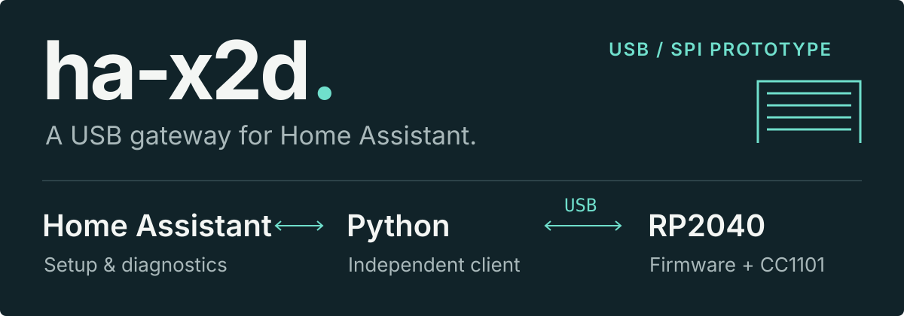

<p align="center">
  
</p>

An experimental **USB gateway for radio-controlled shutters in Home Assistant**,
built around a **YD-RP2040 and an SPI CC1101**. The aim is local control without
a separate MQTT broker, with a Python client other applications can reuse.

> **Experimental.** USB, SPI and passive STOP reception have been checked on
> hardware. C now opens/stops and closes/stops the current motor from Home
> Assistant OS, with the original remotes preserved. General enrollment and
> other motors remain unqualified; the default gateway build keeps RF disabled.

## What works today

- USB identification, connection diagnostics and CC1101 register probing.
- Reproducible offline decoding of passive captures, plus public test vectors.
- USB v2 client and native HA subentries: one cover per shutter, unknown position.
- Simulated two-shutter checks, durable counter journal and STOP queue checks.
- A commands-only build for identities already paired in the dongle journal.
- One real HA OS shutter entity, dashboard controls and an automation STOP check.
- A release archive prepared for HACS custom-repository installation.

The first target is the France Fermetures / Well’com shutter under study.
Its observed C cycle works with asynchronous OOK. Enrollment for other motors
and their identity format still need physical evidence.

## Three parts, one gateway

| Component | Responsibility |
| --- | --- |
| [Home Assistant integration](home_assistant/README.md) | Gateway setup, shutter subentries and diagnostics. |
| [Python client](python/README.md) | Async USB communication, usable independently of HA. |
| [RP2040 firmware](firmware/README.md) | USB contract, radio codec and durable counter journal. |

## Try it locally

On **Linux with glibc**, install [devenv](https://devenv.sh/getting-started/)
and its Nix prerequisite, then run from the repository root:

```sh
devenv shell
devenv test
```

No dongle is needed for the tests. Build the two artifacts with:

```sh
devenv tasks run firmware:build
devenv tasks run ha:package
```

Both artifacts are written to `dist/`. See the [wiring and firmware guide](firmware/README.md)
and [Home Assistant installation guide](home_assistant/README.md) for next steps.

## Home Assistant installation

The manual archive and commands-only firmware work on HA OS 18.3 / Core
2026.9.4 with the C slot already paired in the dongle. USB power management,
open/stop, close/stop and an automation STOP call have been checked on that
installation. The user also confirms control from the dashboard and the
motor's automatic stop at its upper limit; HA still has no position feedback.

For HACS, build `dist/x2d.zip` with `python tools/build_component.py --hacs`.
Publication and a real HACS installation/update remain to be done; follow the
[installation guide](home_assistant/README.md). General enrollment, other
motors, physical STOP latency, old HA backup recovery and power-cut tests
remain separate qualification steps.

[Architecture and trade-offs](docs/EXPLORATION.md) ·
[Radio observations](docs/OBSERVATIONS_RADIO.md) ·
[USB protocol](docs/USB_PROTOCOL.md)

Research notes are in French. The [public-sample checks](research/verify_public_samples.py)
include code adapted from mr-sven under [Apache-2.0](research/LICENSE-APACHE).
