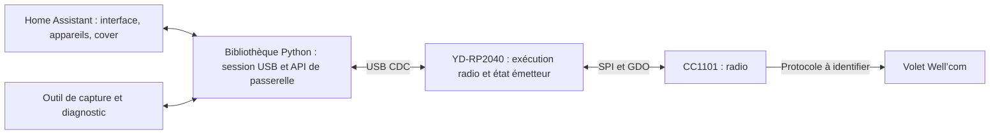

# Exploration : X2D, USB et Home Assistant

27 septembre 2026. Recommandations provisoires, à confronter au matériel.
Ce document décrit la direction issue de l'étude et ses expériences ; il ne
certifie pas la compatibilité du volet. Le premier jalon de diagnostic USB/SPI
est désormais implémenté et son contrat est décrit dans [USB_PROTOCOL.md](USB_PROTOCOL.md).
Les propositions de capture, d'émission et de persistance restent exploratoires.

## 1. Décision proposée

Commencer par **USB CDC + bibliothèque Python asynchrone + intégration Home
Assistant native**, sans service permanent supplémentaire. Développer firmware
et hôte par petites expériences communes : identité USB, réception, analyse,
émission supervisée, puis entité volet.

Le principe réutilisable est celui d'une passerelle radio avec un protocole
documenté. Reproduire le protocole série d'un coordinateur Zigbee n'apporterait
rien à X2D. De même, MQTT est un choix de transport entre applications ; il ne
remplace ni USB ni le codec radio.

**Résultat important de l'exploration :** Franciaflex décrit Well’com comme
**X3D à 868,35 MHz**, et une capture tierce du dépôt diorcety se décode en trames
X3D cohérentes. La priorité fonctionnelle demeure le pilotage des volets de
l'utilisateur ; leur identification effective passe avant le nom X2D donné
initialement au projet. A/B n'ont pas été capturées. [F2, F3]

L'analogie avec les autres piles HA ne dicte pas un seul transport : ZHA utilise
ses bibliothèques pour communiquer avec un coordinateur ; Z-Wave JS emploie
un serveur distinct relié à HA par WebSocket. Les deux offrent une interface
native. Pour notre clé locale, le processus supplémentaire doit avoir une utilité
démontrée avant d'être ajouté. [H11]

Le schéma est la cible initiale, pas un résultat matériel. HA et l'outil de
capture se partagent la bibliothèque, mais **un seul processus possède le port
à la fois**. Les échanges reçus depuis les télécommandes sont des observations,
pas nécessairement des retours d'état du moteur.

## 2. Ce qui est connu

| Élément | Preuve et limite |
|---|---|
| Carte | L'utilisateur confirme **YD-RP2040** ; variante de flash et révision à identifier avant le premier binaire. |
| Radio | L'utilisateur confirme **CC1101 en SPI**. Bande annoncée 868 MHz dans le dossier ; brochage du module, quartz et antenne à vérifier. |
| Volets | Le dossier rapproche les télécommandes France Fermetures de Well’com / Franciasoft MR. Le modèle moteur et la variante RF restent à confirmer. |
| Home Assistant | Lecture seule de l'instance connectée : Core **2026.9.4**, HA OS **18.3**, Raspberry Pi 5, HACS **2.0.5**. Mosquitto est déjà installé. |
| Sources HA | Core `2026.9.4`, commit `9212531f40a0b7b23229a90d688dd79d9dfccff4`. Son manifeste impose frontend `20260826.7`, commit `380e9b5a81ada29a1d187b4123c54fb3d6fbcc89`. |
| Pièce jointe | Un seul Markdown reçu. Les photos, captures et scripts cités dans celui-ci ne sont pas disponibles ici. |

Les informations HA proviennent du connecteur de cette conversation, pas du
forum cité dans le dossier. Les versions publiques ont ensuite été examinées
dans leur code source. Aucune configuration de l'instance n'a été modifiée.

## 3. Ce que permet réellement Home Assistant

### Une intégration USB complète est possible

Le chargeur de HA lit les critères USB des **custom integrations**, pas seulement
ceux des intégrations intégrées. Après installation du composant, un descripteur
USB suffisamment spécifique peut déclencher son assistant de configuration.
Conserver aussi une sélection manuelle avec `SerialPortSelector`. Cibler le
numéro de série matériel et vérifier l'identité par une commande de découverte
non émettrice ; un nom `/dev/ttyACM0` n'est pas une identité. [H1, H2]

Le couple VID/PID de la carte ne doit pas découvrir toutes les YD-RP2040 comme
des passerelles X2D : ajouter une description de produit propre au firmware
dans les critères du manifeste. Le numéro de série distingue ensuite chaque
clé pour son `unique_id` ; on ne publie pas un manifeste propre à chaque numéro.

La bibliothèque série recommandée aujourd'hui par HA est **`serialx`**.
L'intégration Denon RS-232 fournit un exemple actuel de sélecteur série.
Il n'est pas nécessaire de développer un add-on pour ouvrir un périphérique
USB accessible à Home Assistant. L'accès concret au dongle reste à tester
sur HA OS ; en conteneur ou VM, il faut aussi exposer le périphérique. [H3]

Parcours utilisateur envisagé, entièrement dans les écrans natifs :

1. Installer le composant personnalisé, puis découvrir ou sélectionner la clé.
2. Créer une entrée de configuration pour la passerelle.
3. Utiliser « Ajouter un volet » via une sous-entrée ou un flux approprié.
   Le flux guide une association normale, une fois sa séquence RF validée.
4. Nommer le volet et choisir sa pièce ; obtenir une entité `cover`.
5. Accéder à la version du firmware, la connexion et aux diagnostics depuis
   l'appareil passerelle. Les appareils volets lui sont reliés par `via_device`.

Les sous-entrées, les registres d'appareils et les flux de configuration existent
déjà. Le dialogue d'association reste à développer pour notre protocole.
La découverte de la **clé** ne signifie pas découverte automatique des moteurs.
HACS faciliterait la distribution du composant ; une inclusion dans Core serait
un objectif ultérieur, soumis à ses propres critères. [H4]

### Le menu Connectivité n'est pas un registre libre de protocoles

Dans le frontend publié avec Core 2026.9.4, `configSections.connectivity` contient
les chemins connus : Zigbee, Z-Wave, MQTT, série, RF, etc. Les routes sont aussi
déclarées dans le frontend. Aucun mécanisme d'ajout arbitraire « X2D » par un
manifeste de custom integration n'a été trouvé dans cette implémentation. [H5]

Trois niveaux sont donc possibles :

| Présentation | Comment l'obtenir |
|---|---|
| **Appareils et services → X2D** | Intégration personnalisée avec flux, appareils et entités ; première cible. |
| **Connectivité → Série** | Port visible au scanner USB ; attribution prévue avec dépendance `usb` et port sous une clé reconnue telle que `device` dans la configuration. À valider dans le premier essai HA. |
| **Connectivité → Radio frequency** | Fournir une véritable entité d'émission OOK conforme. **Pas pour X3D/FSK dans la version actuelle.** |
| **Connectivité → X2D** | Évolution du frontend HA ou futur mécanisme d'extension ; pas une capacité promise par ce projet. |

Un panneau personnalisé dans la barre latérale est également possible, mais
ajoute du JavaScript à maintenir. Le réserver à un besoin que les écrans natifs
ne couvriraient pas. Ne pas modifier le frontend installé uniquement pour y
insérer un lien. [H6]

### La nouvelle plateforme RF est une option pour l'OOK

Depuis HA 2026.5, `radio_frequency` sépare les adaptateurs radio des intégrations
d'appareils. Un émetteur implémente `RadioFrequencyTransmitterEntity` ; un
consommateur lui transmet un `RadioFrequencyCommand`. Le panneau RF sait lister
ces émetteurs. C'est une base existante à comparer à notre propre passerelle
**si les captures confirment une variante OOK**. La piste X3D/FSK exige un
autre transport de commande avec l'API HA actuelle. [H7]

Dans les versions examinées :

- La modulation exposée est **OOK uniquement**.
- Une commande fournit fréquence, répétitions et durées d'impulsions signées
  en microsecondes ; le modèle prévoit aussi débit symbole et puissance
  optionnels. L'exécution temporelle doit rester dans le RP2040.
- Les interfaces consultées ne fournissent pas un contrat de réception, de
  transaction de rolling code ou d'association X2D.
- `rf-protocols 4.3.0` possède un encodeur **Somfy RTS** dont le compteur est
  fourni par l'appelant. Les rolling codes ne sont donc pas intrinsèquement
  incompatibles avec cette architecture. Aucun encodeur X2D n'a été identifié
  dans l'arbre de cette version. Somfy RTS n'est pas X2D. [H8]

La variante « Python encode X2D → émetteur RF générique → USB → RP2040 » offre
le meilleur alignement avec cette abstraction. Son coût spécifique est la
gestion persistante des identités et compteurs côté hôte, plus un canal de
réception et une priorité STOP à définir. À l'inverse, faire semblant d'accepter
toutes les commandes OOK alors que le firmware ne comprend que `open/close/stop`
serait un mauvais contrat. Une entité RF factice ne doit pas servir de raccourci
pour afficher un menu.

**Critère de décision :** uniquement pour l'OOK, retenir la couche RF générique si elle transporte les
rafales observées, permet un STOP correctement borné et s'accompagne d'une
stratégie de récupération du compteur démontrée. Sinon, commencer par la
passerelle X2D sémantique et ses écrans d'intégration, puis rouvrir l'extension
RF quand elle apporte un usage réel.

## 4. Comparaison des architectures

| Option | Intérêt | Coût ou limite | Position proposée |
|---|---|---|---|
| **Intégration Python → USB → dongle X2D** | Installation locale, assistant d'association adapté, diagnostics et erreurs directement dans HA ; bibliothèque utilisable hors HA. | Firmware et bibliothèque à maintenir ; compatibilité HA à suivre. | **Direction principale.** |
| **Intégration X2D → plateforme RF HA → adaptateur USB générique** | Réutilise le modèle natif RF et son panneau ; protocole indépendant de la radio ; encodeur Python facile à tester. | OOK seulement, donc inapplicable à X3D/FSK ; persistance hôte, RX et STOP à traiter. | **Challenger uniquement si l'OOK est confirmé.** |
| **Intégration → bibliothèque de protocole → modem USB de paquets** | FSK ou OOK selon le profil CC1101 ; analyse et évolution du codec dans Python, firmware plus simple. | API USB propre et récupération du compteur hôte à démontrer ; pas de panneau RF natif pour FSK. | **Premier prototype RX ; challenger de production à la passerelle sémantique.** |
| **HA → MQTT → service USB → dongle** | Bon découplage, découverte MQTT existante, plusieurs logiciels consommateurs ; broker déjà installé ici. | Service série supplémentaire, sémantique des reprises et doublons, flux d'association à construire ailleurs ou en complément. | Solution de repli si service autonome ou autres consommateurs deviennent nécessaires. |
| **HA → service local par WebSocket → USB** | Processus radio isolé de HA, comparable au découpage de certaines piles domotiques. | Déploiement et API réseau supplémentaires pour une clé locale. | À introduire si l'isolation ou le partage du service résout un problème mesuré. |
| **ESPHome + CC1101** | Pilote radio et intégration réseau disponibles. | L'API native documentée utilise TCP ; les logs USB d'un RP2040 sans réseau ne sont pas son transport HA. | Pertinent si le matériel ou le transport réseau change ; pas un raccourci USB établi. |
| **Émulation RFPlayer** | Réutiliserait un consommateur existant. | Compatibilité de protocole hôte à implémenter ; n'apporte pas les trames volet ni l'association ; risque d'hériter de limites de commandes. | Pas de gain démontré pour ce matériel. |

MQTT ne serait pas exécuté directement sur la liaison CDC : un processus côté
hôte traduirait les messages MQTT en appels série. L'absence de Wi-Fi sur le
RP2040 n'empêche donc pas MQTT, mais explique la couche supplémentaire.
MQTT Cover sait exposer les commandes et la disponibilité ; une interface riche
est possible avec du travail supplémentaire. Le choix ne se réduit pas à
« MQTT = mauvaise intégration ». [H9]

Pour tout pont MQTT futur : commandes de mouvement non conservées, pas de
relecture d'une file de mouvements après reconnexion, identifiants de requête
et expiration. Le niveau de QoS ne prouve pas l'exécution unique d'un moteur.
La disparition de la clé doit aussi rendre les volets indisponibles, même si
le broker et le service restent connectés.

## 5. Partager la logique sans créer deux autorités

La contrainte principale est le **compteur tournant**, davantage que le coût
du calcul. Choisir un seul propriétaire de l'identité RF et du compteur.

| Responsabilité | Placement proposé |
|---|---|
| SPI, état du CC1101, horodatage, signaux GDO | RP2040. |
| Exécution d'une rafale et intervalles entre trames | RP2040, indépendamment du délai USB ou de la charge HA. |
| Priorité STOP, bornes de durée, abandon d'ordres périmés | Contrat commun, dernier arbitrage dans le RP2040. |
| Identité d'émetteur, compteur durable, génération d'état | **Préférence initiale : dongle**, pour survivre à une restauration HA ancienne. |
| Codec et format X2D | Python pendant l'analyse ; firmware pour la commande sémantique stabilisée, ou Python durablement si l'option RF générique gagne. Ne pas maintenir deux encodeurs de production. |
| Session USB, validation des messages, erreurs, reconnexion | Bibliothèque Python et firmware, chacun à sa frontière. |
| Noms, pièces, entités, automatisations, assistant utilisateur | Home Assistant. |
| Analyse des captures, comparaison et diagnostics détaillés | Outils hôtes ; mêmes données de référence que le firmware. |

### Option préférée : compteur dans le dongle

Le dongle alloue et persiste le prochain compteur **avant** l'émission. Un
journal protégé contre les écritures interrompues est à tester sur la flash
exacte, avec répartition de l'usure et gestion des interruptions d'exécution
pendant les opérations flash. Deux fichiers ou un simple `save()` ne démontrent
pas cette propriété.

La latence de persistance fait partie du budget STOP : l'exécution depuis la
flash peut être suspendue pendant programmation ou effacement. Prévoir des pages
effacées d'avance au repos et mesurer également le temps de programmation.
Ne pas accepter un mouvement si l'écriture persistante nécessaire à son futur
STOP ne peut pas être assurée sans effacement au mauvais moment. Un
`EEPROM.commit()` effaçant le secteur à chaque commande ne constitue pas une
solution validée. Du code en SRAM ou PIO/DMA peut modifier ces contraintes,
mais sa continuité réelle avec USB/RX est à vérifier sur le binaire final.

Une coupure entre persistance et émission peut consommer un compteur sans
émettre ; la tolérance du moteur à ce saut doit être mesurée. Ne pas réserver
de grands blocs pour réduire l'usure sans connaître sa fenêtre d'acceptation.
La politique au débordement 16 bits reste aussi à confirmer sur ce protocole.

Une sauvegarde HA contient les noms et références des identités, pas une
autorité permettant de rétablir un ancien compteur dans le dongle. Prévoir une
génération d'état permettant de détecter remplacement, effacement ou restauration
du firmware. Une perte d'état ne doit pas recréer silencieusement la même
identité avec un compteur nul : nouvelle association ou récupération explicitement
validée. Le bootloader et les outils de mise à jour doivent préserver la zone
persistante, ou signaler qu'une réassociation sera nécessaire.

Une nouvelle association n'est pas une récupération illimitée : Well’book 195
annonce dix émetteurs par moteur et seize par récepteur, limites à confirmer
pour ce modèle. Avant de compter sur ce recours, vérifier remplacement ou
retrait ciblé d'une ancienne identité et maintien de A/B. Ni le nombre de places
libres ni une procédure de récupération sans effacement global ne sont acquis.
La préservation du journal, les sauts de compteur admissibles et la migration
vers un dongle de remplacement restent des critères de passage. [F2]

### Alternative : compteur côté hôte

Elle reste viable et allège le firmware. Il faut alors un stockage transactionnel
durable **avant envoi**, indépendant d'un état d'entité ou d'une sauvegarde
différée. Restaurer une ancienne base réintroduit toutefois des valeurs déjà
émises. La solution doit soit détecter cette régression à l'aide d'un état
indépendant conservé dans le dongle, soit imposer une récupération d'identité
documentée après restauration.

Ne pas ajouter sans nécessité un système à deux compteurs faisant autorité.
Le premier essai de persistance doit départager ces options ; l'attrait du
panneau RF seul ne suffit pas à trancher.

La recherche firmware privilégie le modem de paquets avec état hôte, qui évite
les écritures flash et accélère l'analyse du protocole. Cette objection est
retenue pour le prototype. Pour la commande opérationnelle, ajouter une marge
fixe au compteur après restauration HA ne suffit pas : l'ancienneté de la
sauvegarde et la fenêtre du moteur sont inconnues. La préférence d'état dans
le dongle reste donc provisoire, en attendant une comparaison démontrée des
stratégies de récupération. Aucun emplacement ne rend une écriture atomique
par lui-même.

## 6. Ébauche du contrat USB

**Historique de l'exploration.** L'implémentation suit maintenant le
[contrat USB v2](USB_PROTOCOL.md), sans compatibilité diagnostic v1. La
qualification et les capacités disponibles sont précisées dans les
[observations radio](OBSERVATIONS_RADIO.md). CDC utilise des messages textuels
délimités, par exemple JSON par ligne. Les commandes sont peu volumineuses ;
un format binaire ne se justifie que si les captures montrent un problème de
débit ou de mémoire. Les durées radio ne doivent jamais dépendre de la cadence
des lignes USB.

| Opération ou événement | Contenu utile |
|---|---|
| `hello` / `info` | Version de protocole et firmware, identifiant du dongle, session de démarrage, capacités et taille maximale de message. Aucun effet RF. |
| `capture.start` / `capture.stop` | Profil RX explicite, fréquence et paramètres consignés ; aucun passage automatique en TX. |
| `rx` | Numéro de séquence, temps monotone, profil, données brutes disponibles et erreurs de capture ; données décodées séparées. |
| `status` | État radio, validité de l'état persistant, identité logique et erreurs. |
| `command` | Variante sémantique seulement : identité logique, action, identifiant de requête et session. Le compteur est alloué par le dongle. |
| `tx_result` | Rejeté, annulé, expiré, émis ou résultat indéterminé. « Émis » ne signifie pas « reçu par le moteur ». |

Pour la variante générique, remplacer `command` par une transmission d'impulsions
bornée et documentée. L'association reste un ensemble de trames déterminé par
les captures, pas une opération `pair` prétendument déjà connue.

Propriétés communes à vérifier :

- Taille, types, fréquence et durées bornés ; rejet des messages tronqués ou
  invalides ; resynchronisation après une ligne corrompue. Aucun champ reçu de
  l'hôte ne devient un accès mémoire ou un numéro GPIO arbitraire.
- Logs séparés des données, ou événements typés ; pas de texte de debug dans
  une réponse machine. Tampons bornés, compteur de pertes, priorité des commandes
  sur le flux de capture.
- Une requête répétée dans une session ne consomme pas un second compteur et
  ne déclenche pas une nouvelle émission. Définir la fenêtre de déduplication.
- Après timeout ou reconnexion, ne pas rejouer un mouvement dont le résultat
  est inconnu. Une nouvelle action utilisateur est distincte d'une retransmission.
- À chaque démarrage, aucune commande de mouvement ou d'association spontanée.
  Une requête d'une ancienne session est rejetée.
- STOP passe avant les mouvements en attente, à la prochaine frontière radio
  sûre ; mesurer le délai maximal sous capture et trafic USB. L'arrêt physique
  reste soumis à la réception radio.

Un identifiant de requête aide à éviter les doublons ; il ne garantit pas une
exécution physique exactement une fois après une coupure. Toute temporisation
ou compensation radio doit rester calibrable sur le matériel réel.

## 7. État du volet dans Home Assistant

La première entité doit offrir `OPEN`, `CLOSE`, `STOP`, avec classe volet,
identifiant stable et état physique inconnu tant qu'il n'est pas observé.
Ne pas activer `SET_POSITION` sur la seule base d'un chronomètre. [H10]

Une commande reçue depuis A/B ou émise par la passerelle donne une intention.
Elle ne prouve ni le mouvement ni la position finale. Les diagnostics peuvent
présenter la dernière commande sans publier artificiellement « fermé ».
La disponibilité signifie ici **chemin de commande opérationnel**, pas moteur
joignable avec certitude. Une estimation temporelle pourrait être une fonction
distincte, explicitement présentée comme estimation et recalibrable.

## 8. Firmware et preuves radio

### Carte et pile de développement

Les sources examinées définissent la YD-RP2040 dans les deux piles : variantes
4/8/16 Mo dans le Pico SDK et carte `vccgnd_yd_rp2040` dans Arduino-Pico. Ce dernier
prévoit plusieurs tailles de flash et un démarrage SPI générique en raison de
variantes matérielles vendues sous le même nom. Identifier la flash réelle avant
de fixer le partitionnement ou d'y écrire des compteurs. [F1]

| Pile | Intérêt pour ce projet | Choix proposé |
|---|---|---|
| **Arduino-Pico + RadioLib** | Support de la YD-RP2040, CDC et pilote CC1101 existant ; chemin court vers une réception instrumentée. | Premier prototype, versions figées. Peut rester la pile finale si les mesures sont satisfaisantes. |
| **Pico SDK + TinyUSB + RadioLib/HAL** | Contrôle explicite de PIO, DMA, USB et flash ; intéressant si l'exécution radio demande du sur-mesure. | Alternative si un besoin mesuré justifie le travail supplémentaire ; pas de réécriture automatique après le prototype. |
| **ESPHome RP2 + CC1101** | Composants existants, intéressants pour une variante disposant d'un transport réseau. | Ne résout pas à lui seul notre transport USB vers HA. |

Pour **l'exploration**, le firmware doit rester un modem de réception aussi
simple que possible, avec analyse Python et sans journal de compteurs. La
préférence de persistance dans le dongle concerne la **commande opérationnelle**,
après identification des trames. Elle ne doit pas compliquer le premier essai.

Les définitions de carte placent SPI0 sur GPIO16–19, la LED RGB sur 23, le bouton
USR sur 24 et la LED sur 25. Le raccordement proposé dans le dossier — MISO16,
CS17, SCK18, MOSI19, GDO0 sur 20 et GDO2 sur 21 — est cohérent avec ces définitions.
Ce sont des **numéros GPIO**, pas l'ordre des broches du module. Alimenter le
module en 3,3 V, avec masse commune ; vérifier sa sérigraphie et sa bande RF. [F1]

### Ne pas choisir la radio à partir du nom commercial

Une transformation de compteur commune ne décide ni la modulation, ni la
fréquence, ni l'association. Les sources donnent plusieurs pistes distinctes :

| Source | Fréquence | Protocole / modulation indiqués |
|---|---|---|
| Annonce commerciale Franciaflex | 868,3 MHz | Well’com, sans validation du profil PHY ici. |
| Well’book 195, lu directement | **868,35 MHz** | **X3D**, modulation non précisée sur cette page. |
| Code `espx2d` diorcety | 868,439941 MHz | X2D / OOK. |
| mr-sven | 868,95 MHz | X3D / FSK, appareils étudiés par cet auteur. |
| Code `espx3d` diorcety | 869,034 MHz | X3D / FSK. |

Ces écarts imposent une fréquence RX réglable. Aucune valeur issue d'un exemple
ne devient un réglage d'émission par défaut sur l'installation. [F2, F3, F4]

Commencer par rechercher des trames complètes de A/B et consigner le profil
utilisé. Si aucun profil ne produit de trames valides, contrôler câblage, antenne,
fréquence et démodulation ; ne pas conclure immédiatement à un protocole inconnu.
Ne pas imposer une série de mouvements du volet pour atteindre un quota de
captures. Des appuis STOP courts peuvent être utiles, en distinguant l'appui
prolongé susceptible d'ouvrir une fenêtre d'association.

Le codec, les répétitions et l'association doivent être déterminés par des
captures reproductibles. Le profil RFPlayer `X2DSHUTTER` ne fournit pas à lui
seul un firmware libre compatible CC1101, et les actionneurs X2D de chauffage
ne valident pas l'association d'un volet.

### Résultat absent du dossier initial : un exemple Well’com X3D

Le dépôt `diorcety/X2D` contient aussi `esphome/components/espx3d/x3d_wellcom.cpp`.
Il construit montée, descente et STOP avec les octets de commande `81`, `82`,
`84` dans la charge `05 98 22 commande 00`. Il propose une association avec
`85 98 22`. C'est un exemple public à étudier, **pas une association validée**
sur notre moteur. Sa base `X3DEntity` réinitialise le compteur à 2 en RAM : elle
ne peut pas être reprise telle quelle pour une passerelle durable. [F3]

Deux vérifications distinctes ont été faites hors ligne :

| Corpus | Résultat | Ce qu'il ne prouve pas |
|---|---|---|
| Quatre exports STOP RFPlayer du dossier | Compteurs 6641–6644. L'en-tête X3D candidat `92 31 F7 01 05 98 22 04 00` suivi du rolling en little-endian reproduit exactement les quatre checksums exportés après permutation des octets. | Le checksum additif ne prouve ni l'ordre des octets ni l'unicité de cette reconstruction ; pas de fréquence, de CRC complet ni de RF brute dans l'export. |
| `raw_x3d.bin` du dépôt diorcety | 30 trames valides, regroupables en six groupes de cinq copies. Deux identités tierces, compteurs 140–142 et 3032–3034 ; longueur de 20 octets, checksum d'en-tête et CRC16 cohérents. | Le fichier est un flux déjà démodulé ; fréquence et modulation n'y sont pas mesurables. Le lien Well’com vient du rapprochement avec le code de l'auteur. |

Les temps déduits supposent l'échantillonnage 400 kHz employé par les outils de
l'auteur : le premier intervalle entre copies est d'environ 44 ms, les suivants
d'environ 60 ms. Ils ne sont pas des temporisations imposées à notre firmware.
La FSK à 40 kbit/s est un paramètre du **code**, pas une mesure RF faite ici.
L'écart STOP `04` dans HACF / `84` dans la capture reste inexpliqué.

Le [contrôle livré](../research/verify_public_samples.py) vérifie les quatre
exports et les six trames distinctes déjà décodées, ainsi que l'aller-retour
du compteur sur 65 536 valeurs. Il ne refait pas l'extraction des 30 trames
du flux brut et ne valide pas une émission. Le fichier source tiers reste
consultable dans le dépôt d'origine ; il n'est pas redistribué ici. Son SHA-256
et le résultat de l'extraction sont conservés dans [les observations](OBSERVATIONS_RADIO.md).

**Conséquence :** tester tôt l'hypothèse X3D pour ces volets. Si elle est confirmée
en FSK, le chemin USB natif reste applicable, mais la plateforme RF HA actuelle
limitée à OOK ne sera pas le transport de leurs commandes. MQTT ne résoudrait
pas cette question de modulation ; c'est le pilote CC1101 qui la traite.

### FIFO et licences : ce qu'on peut réellement réutiliser

Le CC1101 a des FIFO de 64 octets. Les exemples diorcety configurent une longueur
fixe de 255 octets et utilisent RadioLib **5.6.0**. La version **7.8.0** consultée
sait recharger la FIFO en émission ; cela ne valide pas la réception de
l'exemple ancien. Lire une trame courte à l'intérieur d'un paquet configuré à
255 octets exige notamment de vérifier le signal de fin, le timeout et le
vidage de FIFO. Choisir arbitrairement 48 ou 64 octets ne résout pas ce problème.
La trame tierce de 20 octets pourrait tenir en FIFO, mais l'ensemble du chemin
de réception doit le démontrer. PIO/DMA reste une option de capture brute si
le mode paquet masque les informations nécessaires. [F3, F5, F6]

| Source inspectée | Réutilisation envisagée |
|---|---|
| mr-sven `92d9927` | Apache-2.0 : transformation de compteur et références X3D avec attribution ; son association de chauffage ne vaut pas association Well’com. |
| RadioLib `799b377` / 7.8.0 | MIT : pilote CC1101 et HAL ; ne fournit pas à lui seul le protocole volet. |
| Arduino-Pico `b67f3bc` / après 6.1.1 | LGPL-2.1 pour le cœur examiné ; dépendances et notices à conserver selon les composants réellement intégrés. |
| Pico SDK `079c6f3` / 2.3.1 | BSD-3-Clause pour le SDK ; contrôler aussi les dépendances utilisées. |
| diorcety `4d72408` | Aucune licence générale identifiée : référence d'observation, pas de copie de son composant décidée. |
| SixK `d7161d6` | Notices GPL/LGPL différentes suivant les fichiers ; pas le chemin retenu pour le pilote RP2040. |

Les révisions citées sont celles **inspectées**, pas un fichier de dépendances
d'un firmware déjà compilé. Le projet ne reçoit pas globalement la licence d'un
exemple amont : seule la petite vérification adaptée est ici sous Apache-2.0.

## 9. Expériences communes au firmware et à l'hôte

Les premières expériences avancent en parallèle ; les opérations radio dépendent
ensuite des preuves précédentes. Chaque étape laisse un résultat observable.

| Étape | Firmware / matériel | Hôte / Home Assistant | Critère de passage |
|---|---|---|---|
| **A — USB et matériel** | Identifier flash et broches de la YD-RP2040 ; CDC ; lire l'identification et les registres CC1101, TX désactivé. | Petit client `hello`, puis flux HA et déconnexion/reconnexion. | Même identité après changement de port ; port libéré au déchargement ; aucune émission au boot. |
| **B — Réception réelle** | Capturer A/B avec paramètres radio consignés et pertes comptées. | Enregistrer brut, bits et trames ; comparer appuis courts, répétitions et relâchements. | Plusieurs trames complètes cohérentes, checksums et compteurs expliqués ; RSSI seul insuffisant. |
| **C — Comparaison de découpage** | Avec la modulation identifiée, comparer modem de paquets et commande sémantique ; mesurer STOP sous trafic USB. | Tester le codec hôte face au codec embarqué ; évaluer `radio_frequency` seulement pour OOK. | Choisir une seule voie sur fidélité, STOP, persistance, coût et réutilisation ; FSK ne passe pas par l'API RF HA actuelle. |
| **D — Persistance** | Injecter des coupures autour de la réservation, écriture et émission ; vérifier récupération et usure. | Tester timeouts, doublons, restauration ancienne et changement de dongle. | Aucun compteur réutilisé silencieusement, aucun ordre repris au boot ; récupération documentée. |
| **E — Association et commandes** | Identité propre, association normale observée, montée/descente/STOP. | Assistant guidé, résultats d'émission distincts de confirmation utilisateur. | Nouveau contrôleur accepté ; A/B restent utilisables ; STOP effectif, y compris avec ordre en attente. |
| **F — Intégration utilisable** | Binaire reproductible pour le matériel identifié, données persistantes préservées. | Entité `cover`, indisponibilité, diagnostics, installation et tests de cycle de vie. | Utilisation complète sans terminal ; aucune position inventée ; reprise contrôlée après débranchement. |

Les gestes d'association et émissions seront préparés à partir de la notice du
matériel et de captures, avec le volet surveillé. Aucun effacement des associations
ou réglage des fins de course n'est requis par cette exploration.
Avant TX, arrêter un profil de fréquence, puissance et temps d'émission conforme
aux conditions applicables à la bande et au pays d'utilisation ; aucune limite
chiffrée issue d'un exemple radio n'est tenue pour une autorisation d'émettre.

Le premier prototype embarqué utile est **A + B et un client hôte commun**, avec
un test du flux HA sur périphérique simulé en parallèle. Une démonstration avec
un simulateur prouvera le transport et l'interface ; elle ne sera pas présentée
comme preuve de contrôle du volet.

## 10. Conditions pour changer de direction

- Retenir MQTT si un service radio autonome ou plusieurs consommateurs apporte
  un bénéfice concret, ou si le coût de maintien de l'intégration directe devient
  supérieur à celui du pont.
- Retenir le transport RF générique pour une variante OOK si les essais C et D résolvent ses limites
  sans couplage caché à notre dongle. Un autre émetteur restera conditionné à
  sa fréquence, modulation et fidélité temporelle réellement supportées.
- Ajouter PIO/DMA si le mode paquet et ses buffers ne reproduisent pas les
  captures de manière fiable ; ne pas développer les deux moteurs sans preuve.
- Ajouter une interface spécifique lorsque le parcours d'association ou les
  diagnostics sont réellement limités par les formulaires natifs.
- Tester tôt les profils X3D et X2D pour identifier l'installation.
  Garder les variantes RF, messages et association séparés ; ne pas
  développer une pile X3D générale au seul motif d'un compteur commun.

## 11. Sources et vérifications

Sources consultées le 27 septembre 2026. Les observations d'installation sont
issues d'une lecture seule du connecteur HA. Les références de code ci-dessous
sont figées ; les documentations web peuvent évoluer.

- **H1 — Découverte USB :** [chargeur Core 2026.9.4, `async_get_usb`](https://github.com/home-assistant/core/blob/9212531f40a0b7b23229a90d688dd79d9dfccff4/homeassistant/loader.py#L568), [manifeste d'intégration](https://developers.home-assistant.io/docs/creating_integration_manifest/#usb).
- **H2 — Port et attribution :** [USB Core](https://github.com/home-assistant/core/blob/9212531f40a0b7b23229a90d688dd79d9dfccff4/homeassistant/components/usb/__init__.py), [consommateurs de ports](https://github.com/home-assistant/core/blob/9212531f40a0b7b23229a90d688dd79d9dfccff4/homeassistant/components/usb/consumers.py).
- **H3 — Série actuelle :** [migration vers serialx](https://developers.home-assistant.io/blog/2026/04/27/pyserial-to-serialx/), [flux Denon RS-232](https://github.com/home-assistant/core/blob/9212531f40a0b7b23229a90d688dd79d9dfccff4/homeassistant/components/denon_rs232/config_flow.py).
- **H4 — Modèle d'intégration :** [config entries et subentries](https://developers.home-assistant.io/docs/config_entries_index/), [config flow](https://developers.home-assistant.io/docs/core/integration/config_flow/), [device registry](https://developers.home-assistant.io/docs/device_registry_index/).
- **H5 — Navigation réelle :** [sections frontend 20260826.7](https://github.com/home-assistant/frontend/blob/380e9b5a81ada29a1d187b4123c54fb3d6fbcc89/src/panels/config/config-sections.ts#L122), [routes](https://github.com/home-assistant/frontend/blob/380e9b5a81ada29a1d187b4123c54fb3d6fbcc89/src/panels/config/ha-panel-config.ts), [version frontend imposée par Core](https://github.com/home-assistant/core/blob/9212531f40a0b7b23229a90d688dd79d9dfccff4/homeassistant/components/frontend/manifest.json).
- **H6 — Panneau personnalisé :** [panel_custom](https://www.home-assistant.io/integrations/panel_custom/).
- **H7 — RF native :** [introduction de la plateforme](https://developers.home-assistant.io/blog/2026/04/24/radio-frequency-entity-platform/), [panneau utilisateur](https://www.home-assistant.io/integrations/radio_frequency/), [entité Core](https://github.com/home-assistant/core/blob/9212531f40a0b7b23229a90d688dd79d9dfccff4/homeassistant/components/radio_frequency/entity.py), [helpers](https://github.com/home-assistant/core/blob/9212531f40a0b7b23229a90d688dd79d9dfccff4/homeassistant/components/radio_frequency/helpers.py).
- **H8 — Encodeurs existants :** [rf-protocols 4.3.0](https://github.com/home-assistant-libs/rf-protocols/tree/4.3.0/rf_protocols), [contrat de commande](https://github.com/home-assistant-libs/rf-protocols/blob/4.3.0/rf_protocols/commands/__init__.py), [Somfy RTS](https://github.com/home-assistant-libs/rf-protocols/blob/4.3.0/rf_protocols/commands/somfy_rts.py).
- **H9 — MQTT :** [MQTT Cover](https://www.home-assistant.io/integrations/cover.mqtt/).
- **H10 — Entité volet :** [Cover entity](https://developers.home-assistant.io/docs/core/entity/cover/).
- **H11 — Comparaison de piles :** [ZHA](https://www.home-assistant.io/integrations/zha/), [Z-Wave JS et son serveur](https://www.home-assistant.io/integrations/zwave_js/#running-z-wave-js-server).
- **F1 — YD-RP2040 :** [Pico SDK, définition 4 Mo](https://github.com/raspberrypi/pico-sdk/blob/079c6f39023649b154152db30f1d781e884879bc/src/boards/include/boards/vcc-gnd_yd-rp2040_4m.h), [Arduino-Pico, carte et démarrage](https://github.com/earlephilhower/arduino-pico/blob/b67f3bc83c2211b3a821fa4e6929788c881fd0c3/tools/makeboards.py), [broches du variant](https://github.com/earlephilhower/arduino-pico/blob/b67f3bc83c2211b3a821fa4e6929788c881fd0c3/variants/vccgnd_yd_rp2040/pins_arduino.h).
- **F2 — Constructeur :** [Well’book 195, X3D et 868,35 MHz](https://pro.franciaflex.com/medias/FX-ex/book/wellbook/195-Moteur-radio-well-com-questions-reponses.html), [annonce commerciale 868,3 MHz](https://www.franciaflex.com/page/automatismes-2).
- **F3 — Corpus et exemple Well’com :** [X3DWellcomRemote](https://github.com/diorcety/X2D/blob/4d724089425481c50c14115fbbded076c1a848e2/esphome/components/espx3d/x3d_wellcom.cpp), [état réinitialisé](https://github.com/diorcety/X2D/blob/4d724089425481c50c14115fbbded076c1a848e2/esphome/components/espx3d/x3d_entity.cpp), [radio X3D](https://github.com/diorcety/X2D/blob/4d724089425481c50c14115fbbded076c1a848e2/esphome/components/espx3d/cc1101_x3d.cpp), [capture tierce](https://github.com/diorcety/X2D/blob/4d724089425481c50c14115fbbded076c1a848e2/raw_x3d.bin), [outil de référence](https://github.com/diorcety/X2D/blob/4d724089425481c50c14115fbbded076c1a848e2/main_x3d.py).
- **F4 — X3D et compteur :** [mr-sven, protocole](https://github.com/mr-sven/x3d-rfm-esp32/blob/92d9927462b93a2574986aa9e5c5b63dc5997ef4/X3D-Protocol.md), [implémentation Apache-2.0](https://github.com/mr-sven/x3d-rfm-esp32/blob/92d9927462b93a2574986aa9e5c5b63dc5997ef4/x3d-lib/x3d.c).
- **F5 — Pilote actuel :** [RadioLib 7.8.0, CC1101](https://github.com/jgromes/RadioLib/blob/799b377f39e1f14f22fcf827e0b4daccb89d6a0e/src/modules/CC1101/CC1101.cpp), [licence MIT](https://github.com/jgromes/RadioLib/blob/799b377f39e1f14f22fcf827e0b4daccb89d6a0e/license.txt).
- **F6 — Radio physique :** [CC1101 Texas Instruments](https://www.ti.com/product/CC1101), [datasheet](https://www.ti.com/lit/ds/symlink/cc1101.pdf).

Vérifications réalisées : lecture de la pièce jointe, interrogation HA en lecture
seule, consultation des sources publiques, contrôles mathématiques et de trames
publiques, inspection du frontend correspondant à Core 2026.9.4.
Aucune compilation de firmware, aucun flash, aucun test sur HA
avec notre intégration et aucun test radio n'ont été effectués.
